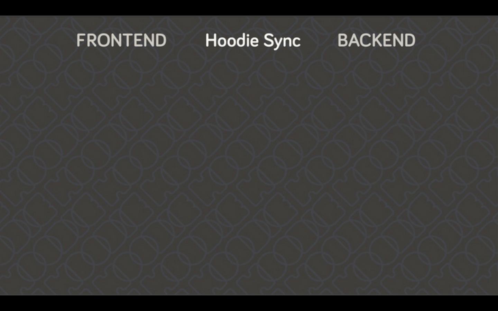
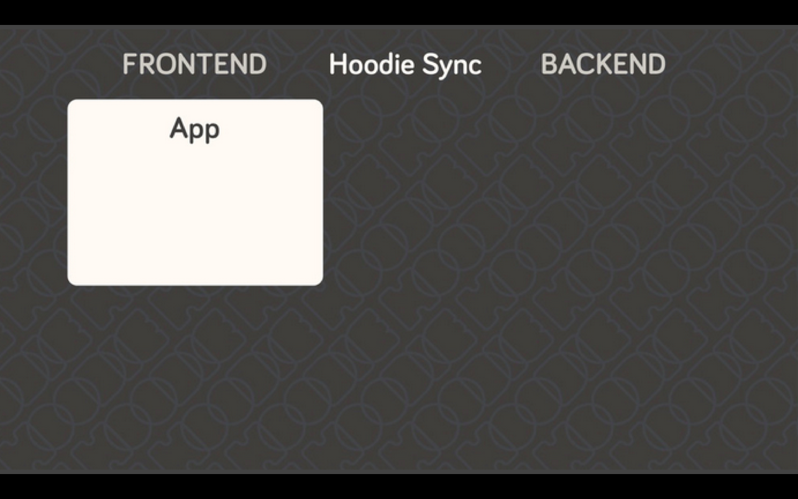
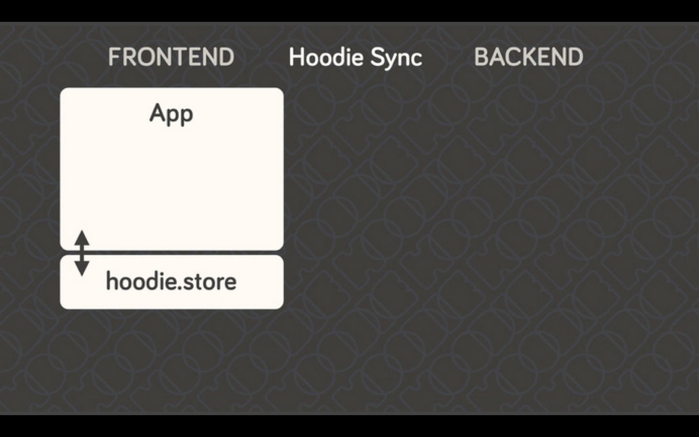
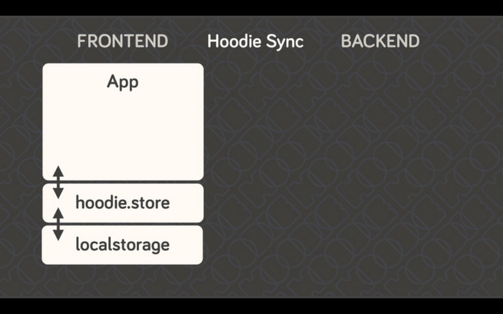
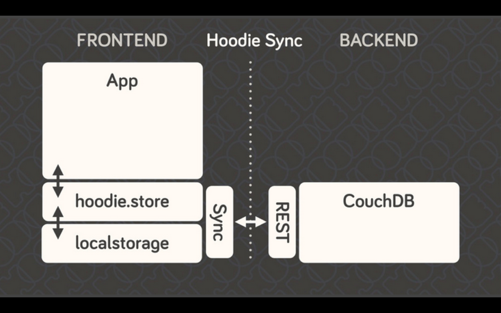
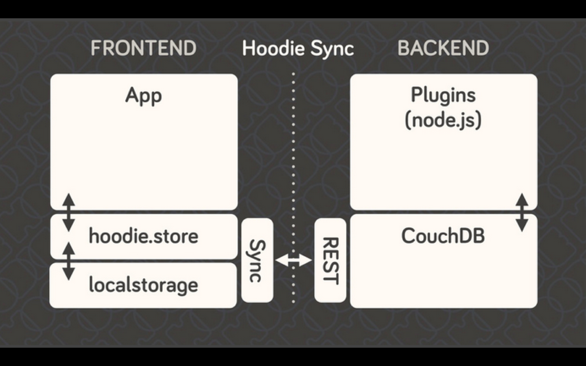

# Behind the Magic – a detailed explanation how Hoodie works

This article shows you how exactly all parts of Hoodie work together to create a seamless, consistent user experience.

### All parts of Hoodie
When we build an app with Hoodie, we have three parts: frontend, backend, and they’re connected with each other through the Hoodie sync.
<p></p>

In the frontend, you have your app...
<p></p>

The app always only talks to the Hoodie API, never directly to the server-side code, database or even in-browser storage.
<p></p>

You can replace localstorage with any in-browser storage of your choice. Here all the data is saves locally. So we do not lose any data, if we are offline.
<p></p>

And at this point, you could already stop if you wanted. This, by itself, is already enough for an app. Still, if you want to save your data on a server, you'll need something in addition.

Hoodie relies on <a href="http://couchdb.apache.org" target="_blank">CouchDB</a>, the database that replicates. In CouchDB, each user has their own private database which only they can access. And all data is private by default. It can be shared to the public if the user decides to, but it can't happen by accident.
<p></p>

There are plugins based on node.js that bring Hoodie’s core features:
* user signup and administration  
* data storage  
* data loading & sync  
* data shares    
* emails  
* payments. // almost there  

These plugins are Hoodie's core plugins. In addition, anyone can build plugins themselves to extend Hoodie's core (see tutorial for [building plugins to extend Hoodie](http://docs.hood.ie/en/plugins/tutorial.html).
<p></p>

This means: with Hoodie, frontend and backend never talk directly to each other. They only leave each other messages and tasks. It’s all very loosely-coupled and event-based, which means it can be interrupted at any stage without breaking. It’s designed for eventual consistency.

### How it works, example: sending a message

Let’s see how this works when an email is moving through the system:

1. The message is written in the app and send
2. The message is passed to hoodie.store and the task "save the message" is send to the localstorage to be saved. 
3. Also hoodie.store checks if the user is online. If so, a task is handed to the sync and through the REST layer the message is saved in our CouchDB database including the message. 
4. The CouchDB database gives a task to the Node.js plugin to send the message including the additional data and the message itself. 
5. The Plugin sends the message.


### How do other devices know data was changed

A huge benefit of Hoodie is not just it's offline first, also it has a build in functionality to send notifications to other devices, when data was added, changed or removed. This are also tasks handed to the app client, when something changes.

This is how it works:
When we add some data to our app, like saving a new message, it works like we described before. In addition to that, CouchDB sends out a task to the user data was changed, to update the data of your app and download it. So you do not have to do it on your own.

### Keeping multiple devices in sync

Imagine the user opened your app in two browser tabs at once or both on their phone and tablet at the same time. Without automatically keeping the data in sync we would soon run into problems where the application and data state is no longer immediately obvious.

Imagine one modifies data in your app, then continues research and comes back to your app to continue data entry. For whatever reason this time they ended up in another open tab and now their previous edits are gone. There are many ways to solve this particular situation, but they always include some kind of manual reload, data merging and most certainly frustration with your app.

To prevent this situation entirely we should automatically update the data that is displayed and even though that is really hard to build on your own – guess what – Hoodie offer this for free.

Using <a href="http://docs.couchdb.org/en/latest/api/database/changes.html?highlight=_changes#get--db-_changes" target="_blank">CouchDB's changes feed</a> Hoodie is always aware of things that happen to the user's data and makes them available via events.

```js
hoodie.store.on('add:todo', function(doc) {
  renderTodo(doc);
});
```

The above code example shows an **add** event for the store type **todo**.
You're most certainly handling this event in order to manage changes to local data already, but you should be aware that this also contains remote data.

You heard that right, the standard **add** event already contains remote data, which means for basic use cases remote sync just happens automatically. Magic indeed.

```js
hoodie.store.on('add:todo', function(doc, options) {
  if (options.remote) {
    return renderRemoteTodo(doc);
  }
  renderTodo(doc);
});
```

There might be use cases where you want to handle remote data explicitly, which is why the options object passed to the event handler contains information about the change's origin.
