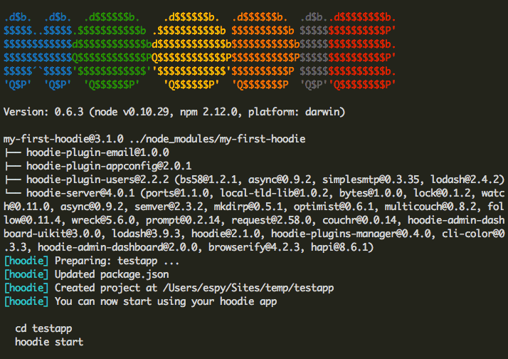
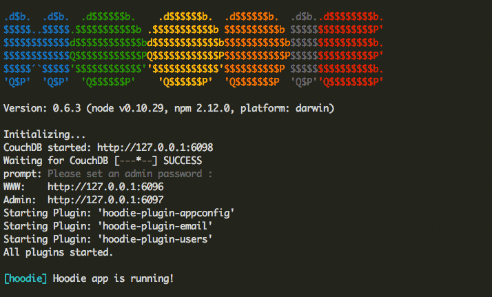

# Getting Started with Hoodie - Part 1

This is the first part of Getting Started with Hoodie, which describes the first steps after you've successfully [installed Hoodie and its prerequisites](/en/start/). In this guide you'll learn how to create a demo Hoodie app, learn about the basic structure of a Hoodie project and its folders, the endpoints and app URLs and how to include and use the Hoodie library in your project.

### Topics Covered in this guide

1. Creating a new app
2. App, Admin and Futon URLs
3. Structure of a Hoodie Project
4. Including the Script
5. The global window.hoodie Object

If you experience any problems at any step of this doc, please check our <a href="http://faq.hood.ie" target="_blank">FAQ</a> or [get in touch with us on IRC or Slack](http://hood.ie/chat).

### 1. Creating a new Hoodie app

Hoodie comes with a command line tool called Hoodie-CLI, which helps you with a lot of Hoodie-related tasks, like setting up and running an app. If you're unsure about anything concerning CLI, you can ask it for help:

```bash
$ hoodie -h
```

If you've never worked with the terminal before, have a quick read through these <a href="http://blog.teamtreehouse.com/introduction-to-the-mac-os-x-command-line" target="_blank">tips and tricks</a>! **Tip 1**: don't type the dollar sign, it's just a convention to signify that this line of code should be run in a terminal.

The very first step is **using Hoodie-CLI to instantiate a new application**. In your terminal, go to the directory you want your application to be in and enter:

```bash
$ hoodie new testapp
```

Here's what will happen:


This is Hoodie downloading all of the libraries it needs to scaffold out your app, setting up the server code, and installing the default plugins. There will now be a folder called **testapp**, in which you'll find a simple demo application. Let's open the directory and start up the Hoodie server!

```bash
$ cd testapp
$ hoodie start
```

On the very first run, you'll be prompted to enter a password for the Admin Dashboard, just pick something simple for now, like **awesome**. Then, a bunch of URLs and additional info appear:

### 2. App, Admin and Futon URLs

Great, your app started up and is now telling you a bunch of things about itself, for example at which URL you can access the app and which plugins it is running. The first thing you'll notice though is that Hoodie opens a browser with the demo app already running in it.

**Note**: if you don't want Hoodie to open a new browser tab, start the Hoodie server with

```bash
$ hoodie start -n
```

The **-n** stands for "no new browser tab please, I've already got one."

Anyway, you'll see three URLs in the CLI output. We'll go through all three.



**Note:** The ports may vary, due to the way Hoodie picks new and free ports with multiple apps. So if this is your first Hoodie app, your ports will start at 6001.

##### The CouchDB endpoint:

```bash
CouchDB started: http://127.0.0.1:6098
```

It's what the Hoodie library talks to when it fetches and stores data. You can append **/_utils** to this URL to reach the CouchDB database admin tool (similar to phpMyAdmin for MySQL), which is called Futon (and will soon be called Fauxton). You can sign in to Futon (or Fauxton) with the admin password you set earlier. For now, you don't really have to bother with it, but in the future, it'll be nice for inspecting the database.

##### The application's URL

```bash
WWW:    http://127.0.0.1:6096
```

This is the URL that Hoodie just opened in a browser for you, it's where your app is running.


##### The Admin Dashboard's URL

```bash
Admin:  http://127.0.0.1:6097
```

We'll cover the dashboard in a later guide, but it's where you can see how many users you have, reset their passwords, check out plugin admin panels etc. Again, the admin password you previously set will get you in.

Now, before we look at the demo app, let's stop the server with **ctrl-c** (on Mac OS X) or **alt+c** (on Win) and take a quick look at the application folder.

### 3.Structure of a Hoodie Project

List the files and folders in your current directory by typing

```bash
$ ls
```
and you should see something like this:

```bash
README.md   data        node_modules    package.json    www
```

##### README.md (file)

Let's get the easiest part out of the way first – the readme file.
As the name suggests, you should read it, as it contains lots of useful information.

##### package.json (file)

Every Hoodie app is a Node.js application and every Node.js application needs a **package.json** file. It defines the name of the app (**testapp** in this case) and its dependencies. It is used to install and declare the used versions of [**hoodie-server**](https://github.com/hoodiehq/hoodie-server) and all core plugins.

##### node_modules (folder)

This is where npm, the package management system for Node, keeps all its files. Hoodie uses it to manage its plugins and dependencies, and you might use it too to manage front- and backend modules in your app. The content of this folder is determined by the previously mentioned **package.json** file in the app folder. To learn more about npm, check out <a href="http://howtonode.org/introduction-to-npm" target="_blank">this introduction</a>.

The contents of this folder are essential for the Hoodie app to work, so there are two things to remember:

1. Do not edit the contents of this folder manually (only through npm).
2. Do not add this folder to source control.

All your changes to the files in this folder will be overwritten whenever you have to install or update dependencies, and it makes no sense to put this huge folder into source control, because everyone can restore it with a simple command:

```bash
$ npm install
```

##### data (folder)

Yup, that's your database. It's not hidden away in **usr/local/** somewhere, it's right there in your app folder. This setup makes it really easy to move the app and its data to another system without much hassle. Also, if you want to clear all of your test data during development, you can just delete or rename this folder, Hoodie will recreate it and you can start with a clean slate. In fact, this folder wasn't generated by **hoodie new**, but by running the app once. **You'll want to leave this out of source control, too.**

##### www (folder)

This is where your app lives. It includes the usual **index.html** and all of the app's assets. If you're into task runners such as Grunt or Gulp, this is where you'd put your compiled code (it's practically your **dist** folder). Hoodie doesn't care about what else you add to the app folder, so feel free to throw in your source folder, tests, more documentation, whatever you like.

Now of course, you won't want to start coding with the Hoodie demo application every single time, which is why **hoodie new** supports templates. Templates can either come in the form of npm packages

```bash
hoodie new appname -t npm package
```
or github repositories

```bash
hoodie new appname -t githubusername/reponame
```

<a href="https://github.com/zoepage/hoodie-boilerplate" target="_blank">Here's a boilerplate template you can start your next Hoodie app with.</a>

### 4. Including the Script

The demo app will already have this line in its **index.html**, but essentially, all you need to do to make your app Hoodie-ready is include a single **js** library:

<pre><code class="language-markup">
&lt;script src="/_api/_files/hoodie.js"&gt;&lt;/script&gt;
</code></pre>

You'll notice that this file isn't in **node_modules** or some **vendor** or **lib** folder, instead, it is *served directly by the Hoodie server itself*. This is cool because it automatically contains all of the installed plugins' frontend code, too. Less hassle for you!

And that's actually it! You're ready to go.

### 5. The global window.hoodie Object

Hoodie is designed to let you build frontends the way you like to build frontends. The only way you talk to Hoodie in the frontend of your app is through the Hoodie API, which lives in a global window object and is, unsurprisingly, called **window.hoodie**, or simply **hoodie**.

Go ahead, open the app in your browser, open the console in your browser's dev tools and type **hoodie.**. It'll show you all of the globally available methods, like **hoodie.account** and **hoodie.store**, which are the most important ones. We'll cover these two in the next part of this guide.

#### Good Job!

For now, **congratulations!** You've created a demo Hoodie app, learned about the basic structure of a Hoodie project, you know all about the endpoints and app URLs and how to include and use the Hoodie library in your project. I'd say you're all set for [part two](/en/tutorials/)!

#### Had any Trouble?

Please check the <a href="http://faq.hood.ie" target="_blank">FAQ</a> or [get in touch with us on IRC or Slack](http://hood.ie/chat).


