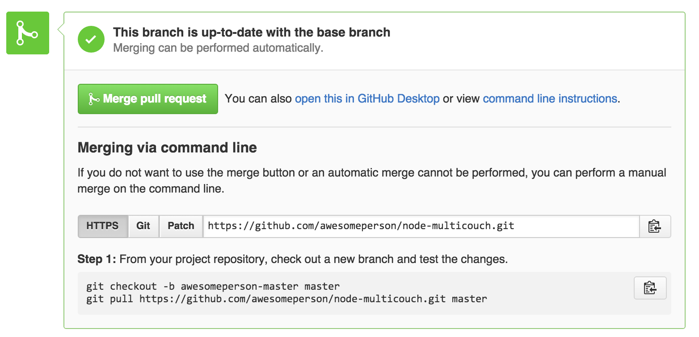

# Testing package pull requests within a Hoodie Application

At Hoodie, we have a lot of different packages we maintain that all work together to make a Hoodie App. At some point, you will be reviewing someones pull request to one of these packages. We can only test that it works by using it within an actual Hoodie application.

We'll use the _node-multicouch_ application as an example.

[node-multicouch](https://github.com/hoodiehq/node-multicouch) is a dependency of [hoodie-server](https://github.com/hoodiehq/hoodie-server). When you create a 
new Hoodie application, it exists within your app at <em>./node_modules/hoodie-server/node_modules/multicouch</em>

To tests someones changes to node-multicouch, you need to get that persons branch. Looking at the pull request on GitHub within the browser, you will see a 'Merge pull request' button. Next to it is a link 'view command line instructions'. Click that.



The commands you need to get their branch will look like this:

```
git checkout -b awesomeperson-master master
git pull https://github.com/awesomeperson/node-multicouch.git master
```

The first command creates a new branch on your machine and checks it out, its name a reminder that this is someones else's work. The second command makes sure that you pull that persons work from their repository. Replace _master_ with whatever they have called their branch.

When within this persons branch, you need to run '_npm link_'. This will set up the start of a link between this persons work, and a _multicouch_ module in a Hoodie App.

Now, you need to go to your Hoodie App. Go to the node modules: '<em>cd ./node_modules/hoodie-server/node_modules</em>' and run the command '_npm link multicouch_'. This will complete the link between the changes that this other person has made, and your Hoodie App. 

'_npm link_' makes the changed _multicouch_ package globally
available on your machine. '_npm link multicouch_' replaces your version of multicouch with the multicouch you wish to review. This version will now be used when you start your Hoodie App. You can now test the changes.

Once you've finished, run '_npm unlink_' in your Hoodie App and in the branch you were reviewing to delete the link. If all worked, then you can go ahead and merge the pull request.
